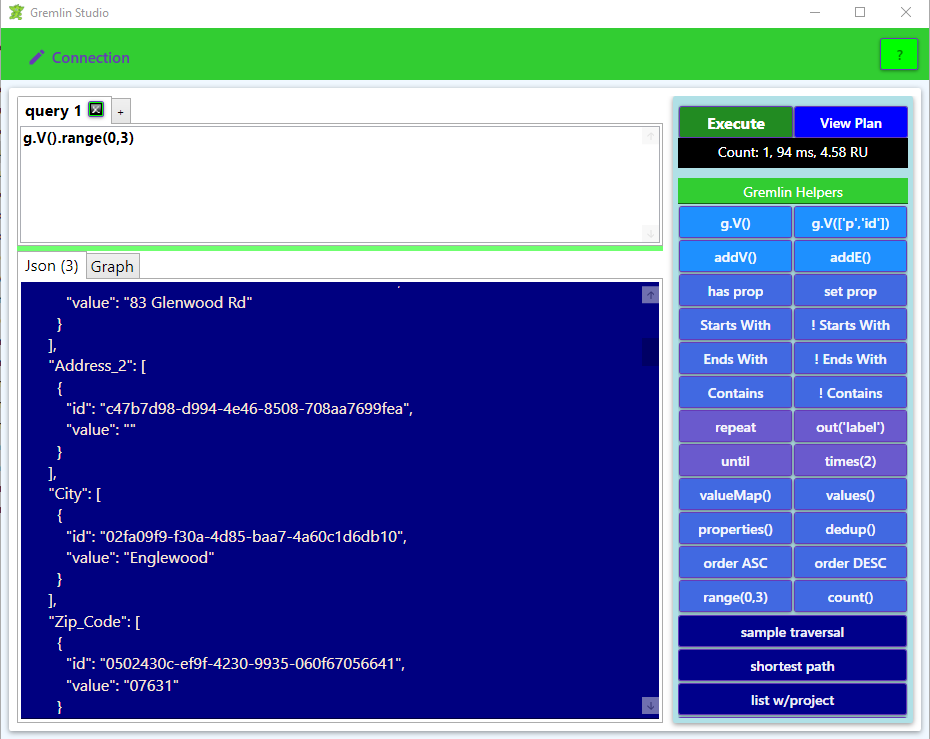
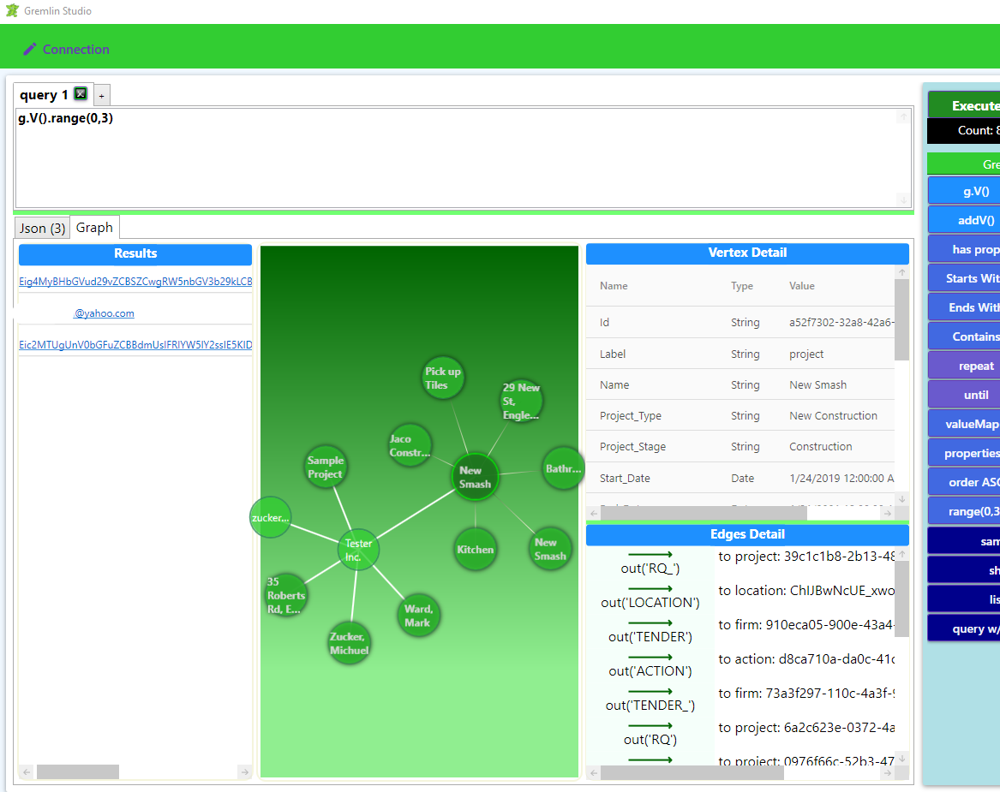

# GremlinStudio
My take on making an Enterprise Query Studio like for SQL Server.

Functionality for Gremlin Studio includes:
- Gremlin query shortcuts
- Gremlin snippets
- Json result tab (when executing)
- Graph result tab (when executing)
- Vertex properties window (when clicking on Vertex)
- Vertex edge details (when clicking on Vertex)
- View Gremlin query execution plan

## Basic Gremlin Query

## Viewing Results as Vertices and Edges

